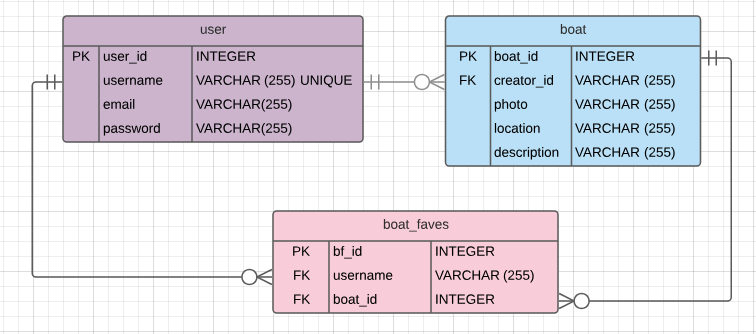

# Daysail

[livelink]

"Connecting the daysailing community."

[Screenshot of main page]

## Table of Contents
   * [Overview](#overview)
      * [User Stories](#user-stories)
      * [Screenshots](#screenshots)
      * [Components](#components)
      * [Project Design](#project-design)
         * [Wireframes](#wireframes)
         * [Technology](#technology)
            * [Core](#core)
            * [Middleware](#middleware)
            * [Additional Tools](#additional-tools)
            * [Database Schema](#database-schema)
      * [Code Snippets](#code-snippets)
      * [Challenges](#challenges)
      * [MVP](#mvp)
      * [Post MVP](#post-mvp)

Created by [gh-md-toc](https://github.com/ekalinin/github-markdown-toc)

# Overview
Daysail is a web application that aims to connect recreational sailors and sailboat owners. Recreational sailors get to see the boats in their area and can express interest with "likes", and owners get to see how much interest there is in their boats.

## User Stories

- A user registers and logs in to the app.
- The user sees a list of all posted boats.
- The user can view the details for one or more boats and clicks "favorite" if he/she likes the boat.
- The user can view a list of their favorite boats.
- A user who owns a boat may:
-- add his/her boat to the app by clicking "Add Your Boat";
-- see the number of likes his/her boat has received by viewing boat details
-- update the information for the boat;
-- delete the boat.

## Screenshots
[ ]

## Components

- Landing page
- Registration Page
- Login page
- Crete new boat
- View of all boats
- View of one boat
- View "faves"
- Edit boat details
- Delete boat

## Project Design
### Wireframes
[ ]

### Technology
- React client
- Express server
- Postresql database

#### Core
[ ]

#### Middleware
[ ]

#### Additional Tools
- Lucid Chart

#### Database Schema


## Code Snippets
```
```
## Challenges

## MVP
- Users of the app must register and then login.
- Users who own boats can add their boat to the app. Owners can also update or delete their boat information from the app.
- All logged on users can look at the boats on the app.
- Users can "like" the boats that they are interested in.
- Users can see a list of the boats they like.
- All users can see the number of likes each boat has received.

## Post MVP
- Boat owners who have extra space for sailors can post a daysail trip. A daysail is a trip that is less than a day, and starts and ends in the same location.
- Owners can update the trip details and delete the trip.
- Users who would like to crew can join a trip.
- Users can remove themselves from a trip.
